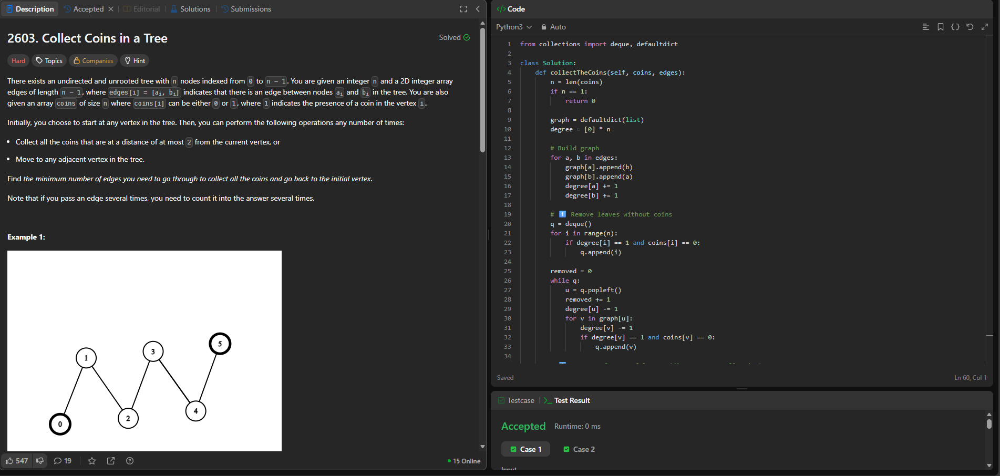

# Trabalho_Árvores_Grupo42

### Trabalho 03 - 27/11/2025

## Aluno 
| Matrícula | Nome |  
|-----------------------|---------------------|  
| 18/0113097 | Daniel Coimbra dos Santos |  

## Descrição do projeto
Resolução de questões do LeetCode para demonstrar na prática os conhecimentos adquiridos acerca do conteúdo Algoritmos de Árvores

### Questão de Dificuldade Difícil:
#### 2603. Collect Coins in a Tree
Hard
There exists an undirected and unrooted tree with n nodes indexed from 0 to n - 1. You are given an integer n and a 2D integer array edges of length n - 1, where edges[i] = [ai, bi] indicates that there is an edge between nodes ai and bi in the tree. You are also given an array coins of size n where coins[i] can be either 0 or 1, where 1 indicates the presence of a coin in the vertex i.

Initially, you choose to start at any vertex in the tree. Then, you can perform the following operations any number of times: 

Collect all the coins that are at a distance of at most 2 from the current vertex, or
Move to any adjacent vertex in the tree.
Find the minimum number of edges you need to go through to collect all the coins and go back to the initial vertex.

Note that if you pass an edge several times, you need to count it into the answer several times.

 
Example 1:

Input: coins = [1,0,0,0,0,1], edges = [[0,1],[1,2],[2,3],[3,4],[4,5]]
Output: 2
Explanation: Start at vertex 2, collect the coin at vertex 0, move to vertex 3, collect the coin at vertex 5 then move back to vertex 2.

Example 2:

Input: coins = [0,0,0,1,1,0,0,1], edges = [[0,1],[0,2],[1,3],[1,4],[2,5],[5,6],[5,7]]
Output: 2
Explanation: Start at vertex 0, collect the coins at vertices 4 and 3, move to vertex 2,  collect the coin at vertex 7, then move back to vertex 0.
 

Constraints:

n == coins.length
1 <= n <= 3 * 104
0 <= coins[i] <= 1
edges.length == n - 1
edges[i].length == 2
0 <= ai, bi < n
ai != bi
edges represents a valid tree.
## Capturas de tela

Pancake Sorting - Questão e Código
 
 

Runtime Metrics
 

Runtime Metrics
 

## Conclusões

## Conclusões

Este algoritmo funciona em 3 etapas principais:

1. Construção da árvore
Criamos a lista de adjacência e calculamos o grau de cada nó.
Isso nos permite manipular a estrutura como uma árvore verdadeira.

2.Poda das folhas sem moedas
Removemos iterativamente todos os nós que:

são folhas (grau = 1), e não possuem coin.
Essa poda elimina partes inúteis da árvore que não contribuem para coletar moedas.

3. Poda das folhas com moedas, mas muito distantes
Após a primeira poda, repetimos um processo semelhante para remover folhas que estão a mais de distância 2 das moedas relevantes.
O objetivo é eliminar caminhos que o jogador nunca precisará percorrer.

Ao final, a quantidade de arestas restantes representa o "núcleo" necessário da árvore.
A resposta final é:
`2 × número_de_arestas_restantes`
## Sobre o algoritmo

## Sobre o algoritmo

Este algoritmo é baseado em uma técnica clássica de árvores chamada pruning (poda). Ela funciona porque árvores não têm ciclos, então remover folhas reduz o problema sem risco de perder conexões essenciais.

A ideia principal é interpretar o problema como:
`“Quais partes da árvore realmente precisam ser percorridas para coletar todas as moedas?”`

A poda resolve isso naturalmente:

. Primeiro removemos subárvores completamente inúteis.
. Depois removemos caminhos que não valem o custo de deslocamento.
. O que sobra é o menor subgrafo que contém todos os vértices relevantes dentro de distância ≤2 do jogador.

Esse método funciona porque:

. Árvore garante caminho único entre nós.
. A poda remove camadas externas irrelevantes sem alterar as distâncias internas.
. O resultado final é sempre minimal.

Trata-se de um problema típico de tree DP / tree pruning, muito usado em:

. compressão de árvores,
. problemas de menor caminho em árvores,
. minimização de percursos obrigatórios em grafos acíclicos.

## Complexidade 

| Etapa do Algoritmo                                               | Descrição                                         | Complexidade                      |
| ---------------------------------------------------------------- | ------------------------------------------------- | --------------------------------- |
| Construir o grafo                                                | Criar lista de adjacência a partir de `n-1` edges | **O(n)**                          |
| Primeira poda (remover folhas sem coin)                          | BFS/queue processando cada nó no máximo 1 vez     | **O(n)**                          |
| Segunda poda (remover folhas com coin mas distantes > 2 camadas) | Outro BFS linear                                  | **O(n)**                          |
| Soma final do tamanho da árvore útil                             | Contar arestas restantes                          | **O(n)**                          |
| **Total**                                                        | Todas as etapas são lineares                      | **O(n)** tempo **O(n)** espaço |

---

## Grupo
 
      <b><a href="https://github.com/DanielCoimbra">Daniel Coimbra</a></b> 
